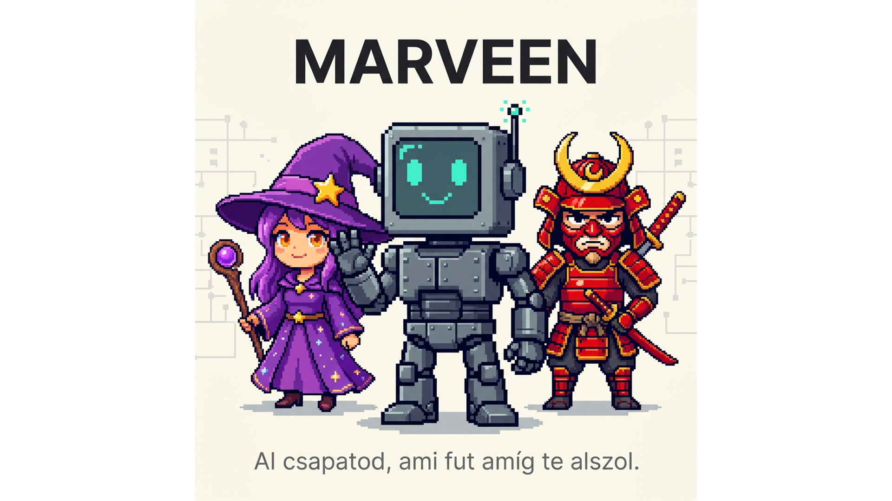

# Marveen



> AI csapatod, ami fut amíg te alszol.

Marveen egy AI asszisztens keretrendszer, ami Claude Code-ra épül. Saját AI csapatot építhetsz, akik Telegramon kommunikálnak veled, önállóan dolgoznak, és egymással is együttműködnek.

## Funkciók

- **AI Csapat**: Több ágens, mindegyik saját Telegram bottal, személyiséggel és memóriával
- **Mission Control**: Web dashboard (http://localhost:3420) a csapat kezeléséhez
- **Inter-agent kommunikáció**: Az ágensek delegálhatnak egymásnak feladatokat
- **Ütemezések**: Cron-alapú feladatok automatikus futtatása
- **Heartbeat**: Csendes háttér-monitorozás, csak fontosnál szól (naptár, email, kanban)
- **Memória**: Hot/Warm/Cold tier rendszer, kulcsszavas kereséssel és gráf nézettel
- **MCP Connectorok**: Gmail, Calendar, Drive, Notion, Slack és más szolgáltatások
- **Skillek**: Újrahasználható képességek az ágenseknek
- **Öntanulás**: Az ágensek automatikusan tanulnak a munkájukból és skill-eket hoznak létre

## Öntanulás (Self-Learning)

A Marveen ágensek automatikusan tanulnak a munkájukból -- a Hermes Agent rendszeréből inspirálódva.

### Hogyan működik?

Az öntanulás 5 összekapcsolt mechanizmusra épül:

#### 1. Nudge rendszer (reflexiós trigger)
- A `PreCompact` hook minden kontextus-tömörítés előtt megkérdezi az ágenst: "Volt-e újrafelhasználható minta a munkádban?"
- A 30 perces memória heartbeat szintén tartalmaz skill reflexiót
- Az ágens saját ítélete alapján dönt, hogy mit ment el

#### 2. Automatikus skill generálás
Komplex feladatok után az ágensek automatikusan SKILL.md fájlokat hoznak létre. Triggerek:
- 5+ tool hívás egy feladatban
- Hiba utáni sikeres recovery
- Felhasználói korrekció
- Nem triviális, többlépéses workflow

A generált skill-ek a `~/.claude/skills/` mappába kerülnek és azonnal elérhetőek.

#### 3. Skill patch (runtime javítás)
Ha egy ágens meglévő skill használata közben jobb megoldást talál:
- Célzottan javítja a skill-t (nem írja újra az egészet)
- A javítás okát dokumentálja a "Buktatók" szekcióban
- A következő használatnál már a javított verzió fut

#### 4. Progressive disclosure (token-hatékony betöltés)
A skill-ek 3 szinten töltődnek be:
- **Level 0**: Csak név + leírás (~100 szó) -- mindig elérhető a skill indexben
- **Level 1**: Teljes SKILL.md tartalom -- csak ha az ágens relevánsnak ítéli
- **Level 2**: Segédfájlok (scripts/, references/) -- csak specifikus szükséglet esetén

A `scripts/skill-index.sh` automatikusan generálja a Level 0 indexet.

#### 5. Skill Factory (meta-skill)
Beépített meta-skill ami bármilyen bemutatott workflow-ból SKILL.md-t generál:
- "Csinálj ebből skill-t" / "Tanítsd meg magad"
- 6 lépéses eljárás: extract → generalize → write → supporting files → index → validate

### Skill struktúra

```
~/.claude/skills/
├── .skill-index.md          # Level 0 index (auto-generált)
├── skill-factory/
│   └── SKILL.md             # Meta-skill: workflow → skill konverzió
├── youtube-video-seo/
│   └── SKILL.md             # Példa: automatikusan generált skill
└── my-custom-skill/
    ├── SKILL.md             # Fő utasítások (<500 sor)
    ├── scripts/             # Futtatható scriptek
    └── references/          # Háttérdokumentáció
```

### Konfiguráció

Az öntanulás a `settings.json` `PreCompact` hookján keresztül működik. A `templates/settings.json.template` tartalmazza az alapértelmezett konfigurációt, ami minden új ágensnél automatikusan beállítódik.

## Telepítés

### macOS / Linux

```bash
git clone https://github.com/Szotasz/marveen.git
cd marveen
./install.sh
```

### Windows (WSL)

```powershell
irm https://raw.githubusercontent.com/Szotasz/marveen/main/install-windows.ps1 | iex
```

Vagy manuálisan:
```powershell
git clone https://github.com/Szotasz/marveen.git
cd marveen
.\install-windows.ps1
```

A Windows telepítő automatikusan beállítja a WSL-t (Windows Subsystem for Linux) és azon belül telepíti a Marveen-t.

A telepítő végigvezet a beállításokon:
1. Függőségek ellenőrzése és telepítése
2. Claude Code bejelentkezés
3. Telegram bot létrehozása
4. Személyes beállítások
5. Szolgáltatások indítása

## Használat

### Dashboard
Nyisd meg: http://localhost:3420

### Telegram
Írj a botodnak Telegramon -- Marveen válaszol.

### Ágensek
A Csapat oldalon hozz létre új ágenseket. Mindegyik:
- Saját Telegram bot
- Saját személyiség (SOUL.md)
- Saját utasítások (CLAUDE.md)
- Saját memória és skillek

### Ütemezések
Időzített feladatok és heartbeat monitorok beállítása:
- Lista, napi idővonal és heti nézet
- Feladat: mindig szól az eredménnyel
- Heartbeat: csendes ellenőrzés, csak fontosnál értesít

### Frissítés
```bash
./update.sh
```

### Leállítás / Indítás
```bash
./scripts/stop.sh
./scripts/start.sh
```

### VPS telepítés (szerver)

Linux VPS-en (Ubuntu/Debian) az `install.sh` változtatás nélkül fut. Az egyetlen különbség: a bejelentkezéshez token kell, mert nincs böngésző.

```bash
# 1. A SAJÁT gépeden (ahol van böngésző):
claude setup-token
# Másold ki a generált tokent (sk-ant-oat01-...)

# 2. A VPS-en:
export CLAUDE_CODE_OAUTH_TOKEN=sk-ant-oat01-...
git clone https://github.com/Szotasz/marveen.git
cd marveen
./install.sh
```

A token 1 évig érvényes. Ne állíts be `ANTHROPIC_API_KEY`-t mellé.

## Követelmények

- macOS, Linux, vagy Windows 10/11 (WSL-lel)
- Node.js 20+
- Claude Code CLI (Claude Max/Pro előfizetés szükséges)
- Telegram fiók

## Közösség és támogatás

Kérdésed van? Csatlakozz az AI a mindennapokban közösséghez:

- **Skool közösség**: [skool.com/ai-a-mindennapokban](https://skool.com/ai-a-mindennapokban) -- oktatóanyagok, kérdések, tapasztalatcsere
- **YouTube**: [AI a mindennapokban](https://www.youtube.com/@aiamindennapokban) -- videók, tutorialok
- **Weboldal**: [aiamindennapokban.hu](https://aiamindennapokban.hu)

## Támogasd a projektet

Ha hasznos számodra a Marveen, támogasd a fejlesztést:

[](https://www.donably.com/ai-a-mindennapokban-szabolccsal)

## Készítette

**Szota Szabolcs** -- AI konzultáns, az "AI a mindennapokban" csatorna készítője

[](https://github.com/Szotasz/marveen)
